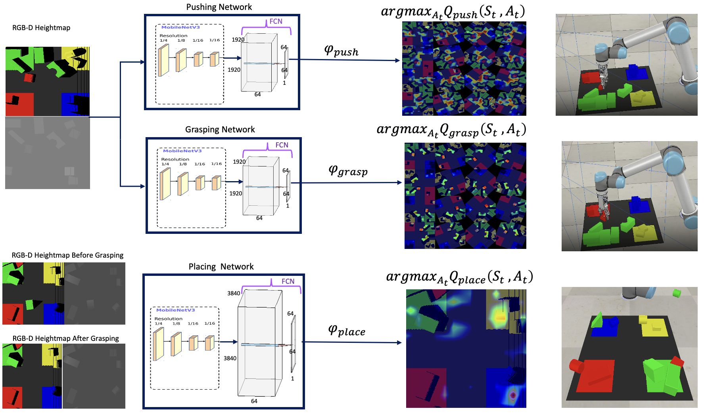
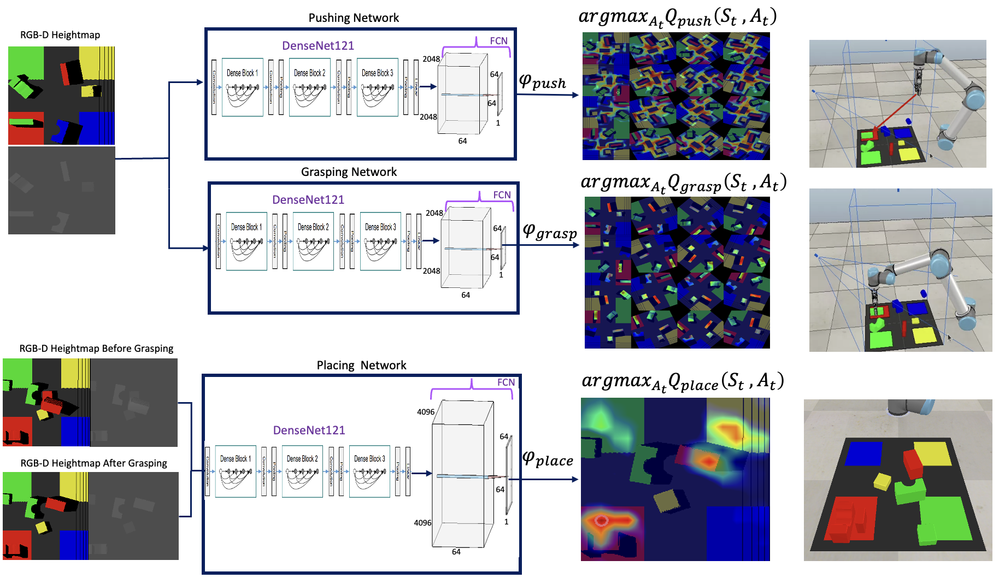
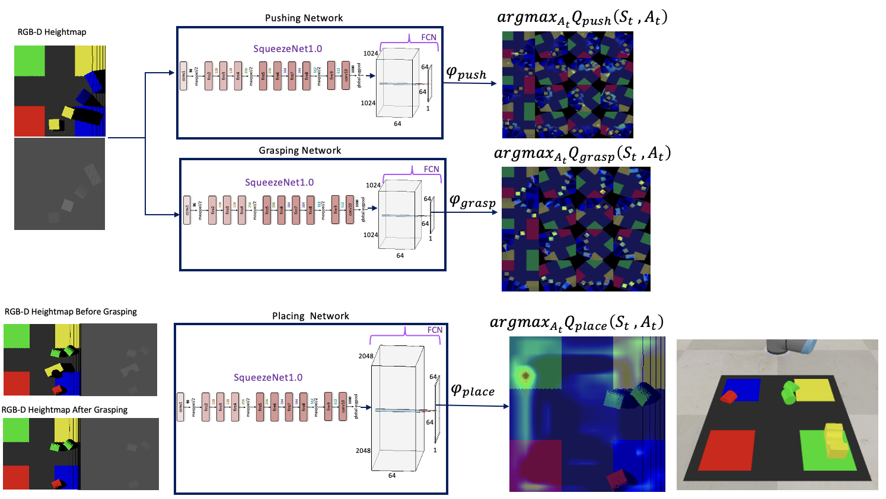

# DRL_for_Object_Sorting
Deep Reinforcement Learning with Light-Weight Vision Model for Sequential Robotic Object Sorting

# Video Demo
An illustration of the training process of our newly proposed deep reinforcement learning agent (PQCN_MobileNetV3_S_FCN) used for sorting object blocks under varying degrees of complexity. 

<!--  -->

 

# Method Overview
This GitHub repository presents an implementation of Pytorch code of deep reinforcement learning (DRL) agents based on Pixelwise Q-valued based Critic Network (PQCN) developed from a modified variant of the Vanilla DQN. The central goal of this project is to perform a comparative analysis on several DRL agents in executing object sorting of several categories of irregular and regular object blocks under a cluttered, occluded, and highly dynamic environment scenario with varying degrees of complexities. In our project, we propose a new variant of a PQCN that factors any of the four kinds of network backbones (MobileNetV3, DenseNet121, DenseNet169, and SqueezeNet1.0) integrated with a custom fully convolutional neural network used for deciding three 
possible optimal actions (pushing, grasping, and placing).
We demonstrate the training and testing of the DRL object sorting policies in simulation environment condition that factors into the UR5 robot arm. 

# PQCN-MobileNetV3-S-FCN
<!--  -->

# PQCN-DenseNet121-S-FCN
<!--  -->

# PQCN-SqueezeNet-S-FCN
<!--  -->

